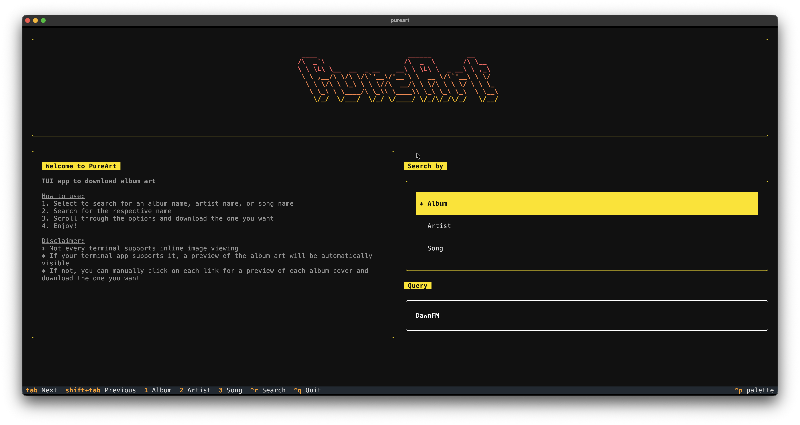
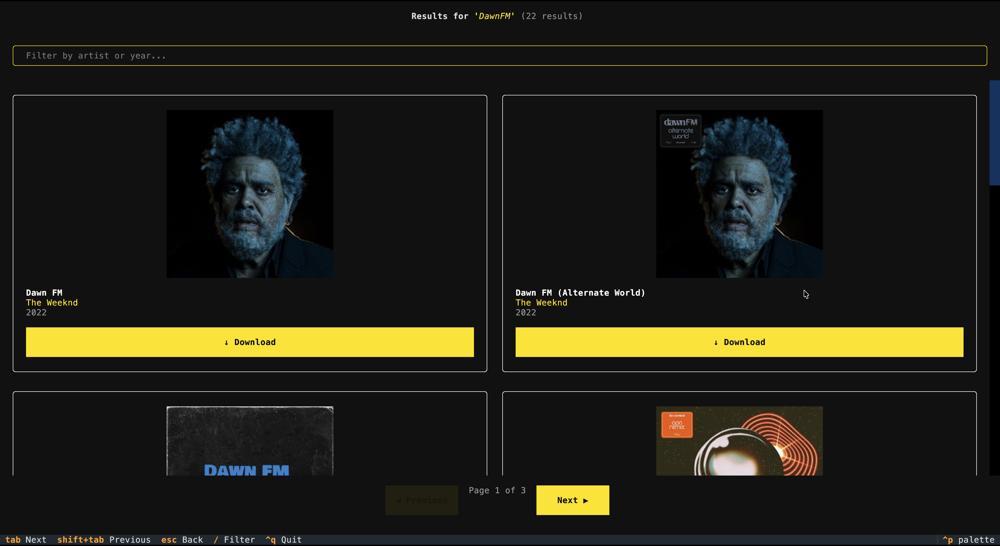
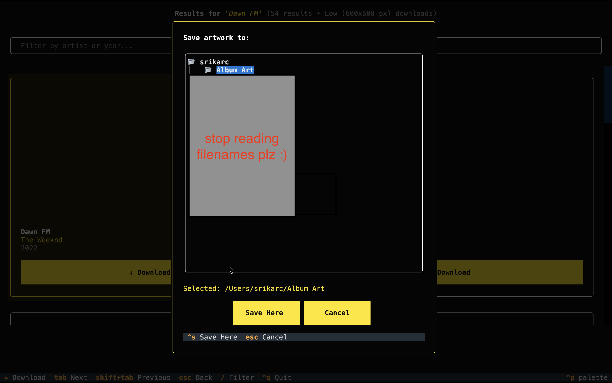

# PureArt

> A Python TUI application for downloading high-resolution album artwork via the iTunes Search API.

PureArt is a terminal-based app that lets you search for any album, artist, or song and download its full-resolution artwork directly to your computer — no subscriptions, no accounts, no browser required. Built with Textual and Rich for a polished terminal experience.

---

## Screenshots

### Main Menu


### Results


### Save Dialog


---

## Features

- Search by **album name**, **artist name**, or **song name**
- Retrieves up to 25 results per search from the iTunes Search API
- Choose between **Low (600×600)**, **Medium (1280×1280)**, and **High (best available)** download quality
- **Inline image preview** in supported terminals (iTerm2, Kitty, WezTerm)
- **Fallback text mode** for unsupported terminals — shows album name, artist, and direct download links
- Built-in **file browser** to choose exactly where artwork is saved
- **Filter results** by artist or year on the results screen
- Paginated results — browse through all matches across multiple pages
- No API key, no account, no subscription required

---

## Requirements

- Python **3.11** or higher
- macOS, Linux, or Windows with a modern terminal

### Terminal Image Support (Optional)

Inline album art previews are available in:

| Terminal | Support |
|---|---|
| iTerm2 | ✅ Full |
| Kitty | ✅ Full |
| WezTerm | ✅ Full |
| Terminal.app | ❌ Text fallback |
| Other terminals | Varies |

If your terminal does not support inline images, PureArt automatically falls back to displaying the album name and artist as styled text with a download button — no configuration needed.

---

## Installation

### Via uv (recommended)

```bash
uv tool install pureart
```

### Via pip

```bash
pip install pureart
```

### From source

```bash
git clone https://github.com/SrikarC6/PureArt.git
cd PureArt
pip install .
```

---

## Usage

### From uv (recommended)

```bash
uv tool run pureart
```

### From any terminal (installed with pip or from source)

```bash
pureart
```

### New: Download Quality Selector

PureArt now lets you choose the artwork resolution directly from the welcome screen before you search:

| Option | Behavior |
|---|---|
| `Low` | Requests a `600×600` artwork file |
| `Medium` | Requests a `1280×1280` artwork file |
| `High` | Requests the best available artwork from Apple using the app's original high-resolution URL behavior |

This changes the **downloaded artwork file only**. Inline previews in the results screen stay optimized for terminal display.

---

## How It Works

### Step 1 — Choose a Search Type

On the main menu, choose what you want to search by and which artwork quality you want to download. You can use the number shortcuts to jump directly to a search type:

| Key | Action |
|---|---|
| `1` | Jump to Album |
| `2` | Jump to Artist |
| `3` | Jump to Song |
| `Tab` | Move focus to next element |
| `Shift+Tab` | Move focus to previous element |

Then type your search query into the **Search** input box and press `Ctrl+R` or `Enter` to search.

### Step 1.5 — Pick a Download Quality

Before running the search, select one of the welcome-screen quality options:

- **Low** for `600×600`
- **Medium** for `1280×1280`
- **High** for the best available image Apple serves for that release

The selected quality is applied after search results are returned, so the search behavior stays the same while the final download URL changes to match the chosen size.

---

### Step 2 — Browse Results

The results screen displays all matching albums in a **two-column grid**. Each result shows:

- Album artwork (if your terminal supports inline images)
- Album name
- Artist name
- Release year
- A **Download** button

Use these controls to navigate the results screen:

| Key | Action |
|---|---|
| `Tab` / `Shift+Tab` | Move between results |
| `Esc` | Go back to the main menu |
| `/` | Focus the filter bar |
| `Ctrl+~` | Previous page |
| `Ctrl+^` | Next page |
| `Ctrl+Q` | Quit |

You can type in the **Filter** bar at the top to narrow results by artist name or release year without making a new search.

---

### Step 3 — Download Artwork

Press the **Download** button on any result to open the **Save** dialog. A file browser lets you navigate your entire directory tree and select exactly where to save the artwork.

| Key | Action |
|---|---|
| `↑` / `↓` | Navigate folders and files |
| `Enter` | Open a folder |
| `Ctrl+S` | Save to the selected location |
| `Esc` | Cancel |

The artwork is saved as a `.jpg` file named after the album and artist. A confirmation toast appears when the download is complete.

---

## Dependencies

| Package | Purpose |
|---|---|
| `textual` | TUI framework |
| `textual-image` | Inline terminal image rendering |
| `rich` | Text styling and gradient logo |
| `pyfiglet` | ASCII art logo |
| `requests` | iTunes API calls and image downloading |
| `Pillow` | Image processing |

---

## How the API Works

PureArt uses Apple's public **iTunes Search API** — no API key or authentication required. Search results include a thumbnail artwork URL which PureArt then rewrites into a size-specific download URL:

```
100x100bb.jpg      →  600x600bb.jpg
100x100bb.jpg      →  1280x1280bb.jpg
100x100bb.jpg      →  10000x10000bb.jpg
```

For the `High` option, Apple's CDN still decides the final delivered resolution. PureArt requests the highest-resolution form of the URL, and Apple serves the best artwork it has available for that specific release.

---

## License

MIT — see [LICENSE](LICENSE) for details.

---

## Author

Made by [Srikar Chitturi](https://github.com/SrikarC6)
